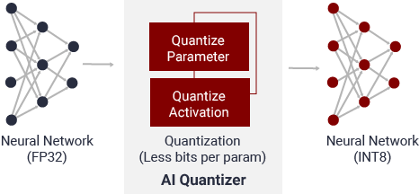
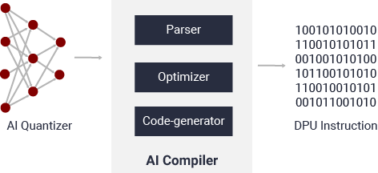

# Guide
This ressource explains the role of each file involved in the process.
The project consists in running different [bash scripts](https://ryanstutorials.net/bash-scripting-tutorial/bash-script.php "Bash") in a specific order.
The bash files are located in the */workflow/* subfolder, while the Python source code is situated in the */src/* subfolder.
Open a terminal and make sure to be placed in the workspace directory **docker_ws**.
```
cd docker_ws
```
### Table of contents
- [1) Load the Vitis AI Docker environment](#docker)
- [2) Initialize the project](#init)
- [3) Build the test set](#set) 
- [4) Run darknet model](#darknet) 
- [5) Convert Dakrnet model to TensorFlow](#convert) 
- [6) Run and evaluate the graph](#graph) 
- [7) Quantize the model](#quantize)
- [8) Compile the model](#compile)
- [9) Compile the application code](#build)
- [10) Create the [model].prototxt file](#prototxt)
- [11) Deploy the model](#deploy)  
- [12) Load the overlay](#overlay)
- [13) Run the application code and evaluate the results](#run)
---
<div id='docker'/>

## 1) Load the Vitis AI Docker environment
The first step is to open the Vitis AI Docker image to access the Vitis AI tools and libraries.
We load the Docker image for CPU host : [xilinx/vitis-ai-cpu:latest](https://hub.docker.com/r/xilinx/vitis-ai-cpu "Docker Vitis AI CPU").
However, if you have a compatible NVIDIA graphics card with CUDA support, you can use GPU recipe.
We took the [script ```docker_run.sh``` from Xilinx](https://github.com/Xilinx/Vitis-AI/blob/master/docker_run.sh "Docker run")
and modified the location of the workspace to fit the structure of our project, and also [added the argument](https://github.com/Xilinx/Vitis-AI/issues/448 "Issue with Vitis AI Profiler on Docker") ```-v /sys/kernel/debug:/sys/kernel/debug  --privileged=true``` when calling the ```docker run``` command.
```
source ./workflow/0_start_docker_cpu.sh
```
---
<div id='init'/>

## 2) Initialize the project
Once we access the Docker virtual environment, we need to specify a few environment variables that will help to organize our project.
We also activate the Conda environment for the Vitis AI TensorFlow framework so as to use the proper Python libraries and Vitis AI commands during the process.
```
source ./workflow/1_set_env.sh
```
---
<div id='set'/>

## 3) Build the test set
So as to evaluate later the YOLOv4 model, we need to prepare the test set. In our case, we have a test set in the path */data/dataset_apples* that contains images of apples, and text files for each of them indicating the location of the fruits (bounding boxes) and a label telling whether they are clean or damaged. 

The bash script below calls the Python program *gather_labels_anchors.py* located in the folder */src/eval* to gather the labels and bonding boxes data to a single text file. This way, it will be easier to evaluate the mAP score of the YOLOv4 later on. We simply need to provide the name of the dataset to read from, */data/dataset_apples*, the format of the images, *.jpg*, and the output text file, */data/labels_anchors.txt*. This text file will be our ground truth for model evaluation.

Then, it calls *prepare_data.py* from */src/utils* to extract the images from the dataset */data/dataset_apples* and place them in a new folder, */data/test_images*. Again, we need to specify the image format. The output of this Python script is a text file, */data/test_list.txt*, that lists the name of the images from the dataset. This will be useful when running the Darknet model.
```
source ./workflow/2_build_test_set.sh
```
---
<div id='darknet'/>

## 4) Run darknet model
Our starting point is the YOLOv4 darknet model configured and trained to detect and classify clean and damaged apples. Although we changed a few things in the *.cfg* file before training in order to make the model run on the accelerator card, this Darknet model is the work of a datascientist. This will be our reference when evaluating the loss of quality and the acceleration factor of the transformed model running on the embedded platform.

The following bash file runs the Darknet model over the test set using a specific application from [AlexeyAB](https://github.com/AlexeyAB/darknet "AlexeyAB Darknet"). The results, that is to say the text file containing the coordinates and labels of the detected apples, are placed in the folder */output/1_darknet_software*.
```
source ./workflow/3_run_darknet.sh
```
---
<div id='convert'/>

## 5) Convert Dakrnet model to TensorFlow
Since we are using the Vitis AI TensorFlow environment, we call the Darknet to Keras and then Keras to TensorFlow converters from the project [TF Keras YOLOv4/v3/v2 Modelset by David8862](https://github.com/david8862/keras-YOLOv3-model-set "TF Keras YOLOv4/v3/v2 Modelset"). The input files are the */model/darknet/yolov4_apple.cfg* and */model/darknet/yolov4_apple.weights* files, that describe the model. The intermediate Keras model is placed in the path */model/build/tensorflow/yolov4_apple.h5*, while the path tothe final TensorFlow frozen graph is */model/build/tensorflow/yolov4_apple_frozen.pb*.
```
source ./workflow/4_darknet_keras_tf.sh
```
It may be useful to check the name of the input and output tensors, and also the input shape, given that we need this information to proceed our transformations.The below script  calls the Python program *get_io_tensors.py* located in the folder */src/utils*. We just have to specify the path to the frozen graph, that is to say */model/build/tensorflow/yolov4_apple_frozen.pb*. This script, inspired by the [NEWBEDEV website](https://newbedev.com/given-a-tensor-flow-model-graph-how-to-find-the-input-node-and-output-node-names "Given a tensor flow model graph, how to find the input node and output node names"), displays the name of the input and output tensors, and the shape of the input tensor.

Input tensor :
- Tensor n°1 : image_input, shape=[-1, -1, -1, 3]

Output tensors :
- Tensor n°1 : conv2d_109/BiasAdd
- Tensor n°2 : conv2d_101/BiasAdd
- Tensor n°3 : conv2d_93/BiasAdd

```
source ./workflow/5_get_io_tensors.sh
```
In case you would like to visualize the whole architecture of the TensorFlow graph, you can run the following script, that uses TensorBoard. It calls the Python program *open_tensorboard.py* from the folder */src/ai_model*, and takes as input the frozen graph */model/build/tensorflow/yolov4_apple_frozen.pb*, a port number for TensorBoard, and a log directory, also for TensorBoard purposes. We ask you to open a link via a web browser to load the graph. When you are done, enter *CTRL-C* in the terminal.
```
source ./workflow/6_run_tensorboard.sh
```
---
<div id='graph'/>

## 6) Run and evaluate the graph
We can run the TensorFlow frozen graph */model/build/tensorflow/yolov4_apple_frozen.pb* to evaluate the eventual loss of quality of the YOLOv4 model due to the transformations. The hereunder bash file runs the Python program *run_graph.py* from */src/eval*. It takes as arguments the path to the frozen graph, the name of the input and output nodes, the path to the test set */data/test_images*, the format of the images, *.jpg*, the text files containing the *es */model/specs/apples_classes.txt* and anchors */model/specs/yolov4_anchors.txt*, the threshold values for object detection and Non-Maximum Suppression, and the output text file containing the labels and coordinates of the bounding boxes corresponding to the detected apples */output/2_graph/output.txt*.

```
source ./workflow/7_run_graph.sh
```

Evaluate the graph by running the following script. Be careful, this is still a work in progress.
```
source ./workflow/8_eval.sh
```

---
<div id='quantize'/>

## 7) Quantize the model
We launch the [Vitis™ AI Quantizer for TensorFlow](https://www.xilinx.com/html_docs/xilinx2019_2/vitis_doc/tensorflow_1x.html#zuc1592307653938 "Vitis AI Quantizer") to convert the floating-point frozen graph */model/build/tensorflow/yolov4_apple_frozen.pb* (32-bit floating-point weights and activation values) to a fixed-point integer (8-bit integer - INT8) model by [quantizing](https://www.dictionary.com/browse/quantized "quantize") the weights/biases and activations to the given bit width. This way, we reduce the computing complexity without losing much quality. This transformed model requires less memory bandwidth, thus providing faster speed and higher power efficiency than the floating-point model. This is practical knowing that the FPGA is limited in terms of memory and bandwidth. [Here](https://www.xilinx.com/html_docs/vitis_ai/1_3/eku1570695929094.html "Vitis AI Quantizer Flow"), you can find some explanations about the quantizer flow.



The output is the quantized model, which is saved to the path */model/build/quantize/quantize_eval_model.pb*. After calibration, the quantized model is transformed into a DPU deployable model ready to be compiled. We have to indicate the name of the input and output nodes from the frozen graph, and the input shape. We also specify a number of iterations used for the calibration part.

This process includes a calibration phase in which we use a callback function defined in the Python script *image_input_fn.py* from the folder */src/calibration*. The callback function is named *calib_input* is run at each iteration of the calibration process. To perform the calibration, it opens at each iteration a batch of images listed in the file */data/calib_image_list.txt*.

The calibration dataset is created by the Python program *build_calib_data.py* situated in the folder */src/calibration*. It takes images from the dataset */data/dataset_apples*, copy a certain number of images of specific format (*.jpg* in our case), randomly selected, to the folder */data/calib_dataset*, and lists the selected images in the file */data/calib_image_list.txt* used during the calibration process.
```
source ./workflow/9_quantize_model.sh
```
---
<div id='compile'/>

## 8) Compile the model
The [Vitis™ AI Compiler for TensorFlow](https://www.xilinx.com/html_docs/xilinx2019_2/vitis_doc/compiling_model.html "Compiling the Model") is called by the following script to compile the model */model/build/quantize/quantize_eval_model.pb* by mapping the network to an optimized DPU instruction sequence, according to the DPU of the target platform (DPUCAHX8H in our case). You can find the DPU configuration file in the path */opt/vitis_ai/compiler/arch/DPUCAHX8H/U280/arch.json*. The XCompiler (XIR based Compiler) constructs an internal computation graph as intermediate representation (IR) and performs several optimization steps.



We provide a name for the compiled model, *yolov4_apple.xmodel*, and we place it into the output folder */model/build/compile/yolov4_apple*. We also have to specify the input shape to the compiler.
```
source ./workflow/10_compile_model.sh
```
---
<div id='build'/>

## 9) Compile the application code
We can now compile the application code *yolov3.cpp* that is located in the path */src/app* with all its dependencies, with the C++17 compiler. The below script calls the *workflow/app/build.sh* one to do the work. The compiled file is located in the path */src/app/yolov3*.
```
source ./workflow/11_compile_app
```
---
<div id='prototxt'/>

## 10) Create the [model].prototxt file
During runtime, when we will call the Vitis AI Library to load our custom YOLOv4 model, it will look for a *prototxt* file having the same name as the compiled model (*yolov4_apple.xmodel*), that is to say *yolov4_apple.prototxt*. We can find some templates from [Vitis AI programming examples](https://www.xilinx.com/html_docs/vitis_ai/1_3/prog_examples.html#ariaid-title3 "Vitis AI programming example") and [tutorials](https://github.com/Xilinx/Vitis-Tutorials/blob/master/Machine_Learning/Design_Tutorials/07-yolov4-tutorial/dpu_yolov4/dpu_yolov4.prototxt "YOLOv4 Tutorials"). It is like a wrapper.

We automated the creation of this file to simplify the process. The below bash file runs the program *create_prototxt.py* from */src/utils* that takes as input the name of the model, *yolov4_apple*, the list of the output node names, *conv2d_93/BiasAdd,conv2d_101/BiasAdd,conv2d_109/BiasAdd*, the detection and NMS threshold values, the path to the classnames */model/specs/apples_classes.txt* and anchors */model/specs/yolov4_anchors.txt* files, and produces the file */model/prototxt/yolov4_apple.prototxt*.
```
source ./workflow/12_create_prototxt.sh
```
We then copy the file */model/prototxt/yolov4_apple.prototxt* to the path */model/build/compile/yolov4_apple* so as to have the *yolov4_apple.prototxt* and *yolov4_apple.xmodel* within the same location.
```
source ./workflow/13_add_prototxt.sh
```
---
<div id='deploy'/>

## 11) Deploy the model
Given that the Vitis AI Library looks into the folder */usr/share/vitis_ai_library/models/* to load models, we copy the files from the folder */model/build/compile/yolov4_apple*, which contains the *yolov4_apple.prototxt* and *yolov4_apple.xmodel* files, to this location.
```
source ./workflow/14_deploy_model.sh
```
---
<div id='overlay'/>

## 12) Load the overlay
We can now load the overlay that suits the DPU of type DPUCAHX8H so as to configure the accelerator card. We have to download an archive, *alveo_xclbin*, untar it, and copy the files for the target platform, *U280/14E300M/dpu.xclbin* and *U280/14E300M/hbm_address_assignment.txt*, to the */usr/lib* folder.
We only download the archive if it is not already downloaded to the workspace.
```
source ./workflow/15_load_overlay.sh
```
---
<div id='run'/>

## 13) Run the application code and evaluate the results
The final step is to run the application */src/app/yolov3.cpp* on the accelerator card. We specify the name of the YOLOv4 model to load, *yolov4_apple*, the name of the test set */data/test_images*. We also provide the path to the file listing the classnames */model/specs/apples_classes.txt*, and the name fo the Alveo accelerator card *U280* for logs. The output data are the processed images */output/3_alveo/images* and the file containing the bounding boxes and labels for evaluation */output/3_alveo/output.txt*.

The application code is based on the Vitis AI Library which offers a [YOLOv3 class](https://www.xilinx.com/html_docs/vitis_ai/1_3/yolov3.html "vitis::ai::YOLOv3") that can also handle YOLOv4 compiled models. Additional information can be found [here](https://www.tutorialfor.com/questions-313895.htm "YOLOv3Result"). 

The rest of the program is about loading the images from the test set, postprocessing the bounding boxes coordinates, measuring the execution time, drawing rectangles and writing the label and confidence at the location of the detected objects, saving the modified images, and storing the logs in a file.

```
source ./workflow/16_run_app.sh
```
Finally, we can evaluate the _mAP_ score by comparing with the data from the ground truth file */data/labels_anchors.txt*. To achieve that, we call the Python program *eval.py* located in the folder */src/eval*. We need to provide the detection and NMS thresholds.
```
source ./workflow/17_eval_score.sh
```


