# YOLOv4-Vitis-AI
Custom YOLOv4 for apple recognition (clean/damaged) on Alveo U280 accelerator card using Vitis AI framework.

### Table of contents
1) [Context](#context)
2) [Vitis AI](#vitis)
3) [YOLOv4](#yolo)
4) [Requirements](#requirements)
5) [User Guide](#guide)
6) [Results](#results)
7) [Axes of improvement](#improvement)
8) [References](#references)

---
<div id='context'/>

## 1) Context
A deep-learning model is caracterized by two distinct computation-intensive processes that are training and inference. [During the training step, the model is taught to perform a specific task. On the other hand, inference is the deployment of the trained model to perform on new data](https://www.intel.com/content/www/us/en/artificial-intelligence/posts/deep-learning-training-and-inference.html "The Difference Between Deep Learning Training and Inference"). Real-time inference of deep neural network (DNN) models is a big challenge that the Industry faces, with the growth of latency constrained applications. For this reason, inference acceleration has become more critical than faster training. [While the training step is most often carried out by GPUs, due to their high throughput, massive parallelism, simple control flow, and energy efficiency](https://medium.com/syncedreview/deep-learning-in-real-time-inference-acceleration-and-continuous-training-17dac9438b0b "Deep Learning in Real Time — Inference Acceleration and Continuous Training"), FPGA devices (Field Programmable Gate Arrays) are more adapted to AI inference, by providing better performance per watt of power consumption than GPUs thanks to their flexible hardware configuration.

An important axis of research is the deployment of AI models on embedded platforms. To achieve that, along with smaller neural network architectures, some techniques like quantization and pruning allow to reduce the size of existing architectures without losing much accuracy. It minimizes the hardware footprint and energy consumption of the target board. These techniques perform well on FPGAs, over GPU.

One significant issue about conjugating AI inference with hardware acceleration is the expertise required in both domains, especially regarding low level development on accelerator cards. Fortunately, some frameworks make hardware more accessible to software engineers and data scientists. [With the Xilinx’s Vitis AI toolset, we can quite easily deploy models from Keras-TensorFlow straight onto FPGAs](https://beetlebox.org/vitis-ai-using-tensorflow-and-keras-tutorial-part-1/ "Vitis AI using TensorFlow and Keras Tutorial"). 

---
<div id='vitis'/>

## 2) Vitis AI
[Vitis™](https://www.xilinx.com/products/design-tools/vitis.html "Vitis") is a unified software platform for embedded software and accelerated applications development on Xilinx® hardware platforms, with [Edge, Cloud or Hybrid computing](https://www.redhat.com/en/topics/cloud-computing/cloud-vs-edge "Cloud vs Edge computing"). The application code can be developed using high-level programming languages such as C++ and Python.

[Vitis™ AI](https://www.xilinx.com/products/design-tools/vitis/vitis-ai.html "Vitis AI") is a development environment whose purpose is to accelerate AI inference. Thanks to optimized [IP cores](https://anysilicon.com/ip-intellectual-property-core-semiconductors/ "IP core") and tools, it allows to implement pre-compiled or custom AI models and provides libraries to accelerate the application by interacting with the processor unit of the target platform. With Vitis AI, the user can easily develop [Deep Learning](https://machinelearningmastery.com/what-is-deep-learning/ "Deep Learning") inference applications without having a strong FPGA knowledge.

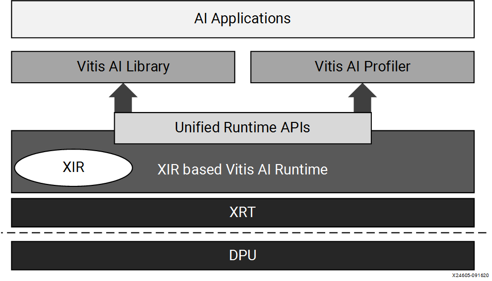

We chose to use the Vitis AI TensorFlow framework. For more information on Vitis AI, please refer to the official [user guide](https://www.xilinx.com/html_docs/vitis_ai/1_3/ "User Guide").

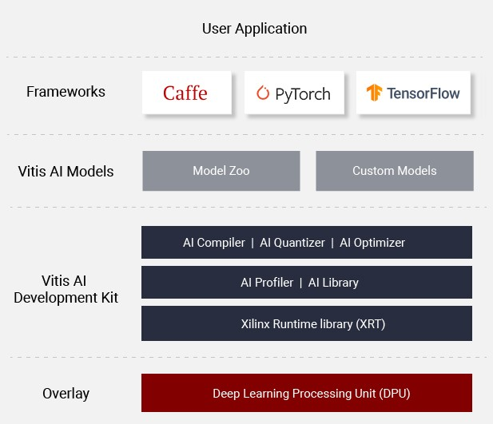

In our case, the hardware platform is an [Alveo™ Data Center Accelerator Card](https://www.xilinx.com/products/boards-and-kits/alveo.html "Alveo"). This [FPGA (Field Programmable Gate Arrays)](https://www.xilinx.com/products/silicon-devices/fpga/what-is-an-fpga.html "Xilinx FPGA") is a Cloud device to accelerate the computing workloads of deep learning inference algorithms. Its processor unit is called a  [Deep-Learning Processor Unit (DPU)](https://www.xilinx.com/html_docs/vitis_ai/1_3/tools_overview.html#nwc1570695738475 "DPU"), a a group of parameterizable IP cores pre-implemented on the hardware optimized for deep neural networks, compatible with the Vitis AI specialized instruction set. Different versions exists so as to offer different levels of throughput, latency, scalability, and power. The [Alveo U280 Data Center Accelerator Card](https://www.xilinx.com/products/boards-and-kits/alveo/u280.html "Alveo U280") supports the [Xilinx DPUCAHX8H DPU](https://www.xilinx.com/html_docs/vitis_ai/1_3/tools_overview.html#xyt1583919665886 "DPUCAHX8H") optimized for high throughput applications involving [Convolutional Neural Networks (CNNs)](https://towardsdatascience.com/a-comprehensive-guide-to-convolutional-neural-networks-the-eli5-way-3bd2b1164a53 "Convolutional Neural Networks"). It is composed of a high performance scheduler module, a hybrid computing array module, an instruction fetch unit module, and a global memory pool module.

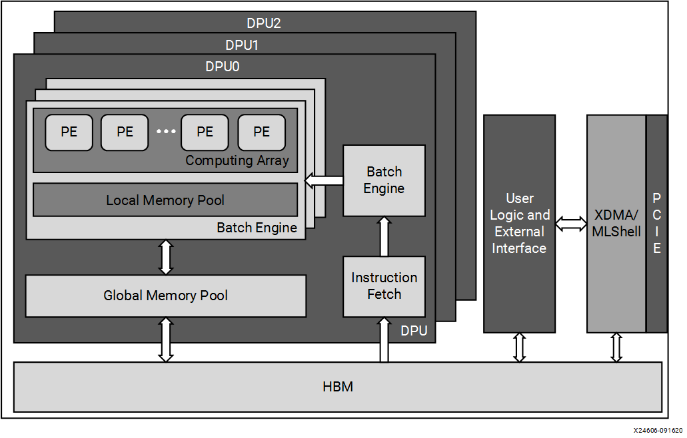

---
<div id='yolo'/>

## 3) YOLO
A [YOLOv4 model](https://www.analyticssteps.com/blogs/introduction-yolov4 "Introduction to YOLOv4") is able to detect objects in images through bounding boxes, classify the objects among a prefefined list of classes, and attribute a confidence score for each prediction. Please read [this article](https://becominghuman.ai/explaining-yolov4-a-one-stage-detector-cdac0826cbd7 "Explanation of YOLO V4 a one stage detector") and [this one](https://blog.roboflow.com/a-thorough-breakdown-of-yolov4/ "Breaking Down YOLOv4") too to better understand the concept.


The original Darknet model was made from [this tutorial](https://medium.com/analytics-vidhya/train-a-custom-yolov4-object-detector-using-google-colab-61a659d4868 "TRAIN A CUSTOM YOLOv4 OBJECT DETECTOR (Using Google Colab)"). To implement your custom model, make your changes according to the section "Create your custom config file and upload it to your drive".

Our model was trained to detect apples in images and determine whether they are clean or damaged. The classes are written in this [file](model/specs/apples_classes.txt "Classes") and the anchors [here](model/specs/yolov4_anchors.txt "anchors").

To build the [dataset](https://github.com/Pomiculture/YOLOv4-Vitis-AI/tree/main/data "Dataset"), we used this [scraper](https://github.com/Menchit-ai/parse-google-image "Parsing google image"). 

To annotate the samples, we used [this GitHub project by developer0hye](https://github.com/developer0hye/Yolo_Label "Yolo_Label"). The annotations follow the template "image_name class_label x_top_left y_top_left width height".

To make the model fit the accelerator card, we had to change the MaxPool size, and convert the mish activations to leaky RELU. Our changes are based on [this tutorial](https://github.com/Xilinx/Vitis-Tutorials/blob/master/Machine_Learning/Design_Tutorials/07-yolov4-tutorial/README.md#21-darknet-model-training-on-coco "Vitis AI YOLOv4 tutorial"). The '*.cfg*' file can be found [here](model/darknet/yolov4_apple.cfg "Darknet.cfg") and the '*.weights*' can be downloaded [here](https://drive.google.com/drive/folders/1EnpvadEDiTrAUQzlouOIwPMlPIdV6Pfh?usp=sharing "YOLOv4 weights").

---
<div id='requirements'/>

## 4) Requirements
Before running the project, check the [requirements from Vitis AI](https://www.xilinx.com/html_docs/vitis_ai/1_3/oqy1573106160510.html "Minimum system requirements") and make sure to complete the following steps :
- **[Install the Vitis AI Docker image](DOC/Docker_&_Vitis_AI.md "Install Vitis AI Docker")**
- **[Set up the Alveo U280 accelerator card](DOC/Alveo_Setup.md "Alveo U280 setup")**

**Weights file** :

🠊 Please download the weights of the YOLOv4 trained model [here](https://drive.google.com/drive/folders/1EnpvadEDiTrAUQzlouOIwPMlPIdV6Pfh?usp=sharing "YOLOv4 weights"). Place the file in the folder */model/darknet*, alongside the '*.cfg*' [Darknet](https://pjreddie.com/darknet/ "Darknet") model.

**Dataset folder** :

🠊 Please unzip the [dataset folder](data/dataset_apples.zip "Apples dataset").

**Versions** :
- Docker : 20.10.6
- Docker Vitis AI image : 1.3.598   
- Vitis AI : 1.3.2      
- TensorFlow : 1.15.2
- Python : 3.6.12
- Anaconda : 4.9.2

**Hardware** :
- [Alveo U280 Data Center Accelerator Card](https://www.xilinx.com/products/boards-and-kits/alveo/u280.html "Alveo U280")

---
<div id='guide'/>

## 5) User Guide
In this section, we are going to explain how to run the project. \
Open a terminal and make sure to be located in the workspace directory. \
This project is executed through a succession of bash files, located in the */workflow/* folder. \
You may need to first set the permissions for the bash files :
```
cd ./docker_ws/workflow/
chmod +x *.sh
cd ..
chmod +x *.sh
```
You can either run the scripts from the */workflow/* folder step by step, or run the two main scripts. \
The first script to run serves to open the Vitis AI image in the Docker container. \
Indeed, we can use the Vitis™ AI software through [Docker Hub](https://www.docker.com/ "Docker"). It contains the tools such as the Vitis AI quantizer, AI compiler, and AI runtime for cloud DPU. We chose to use the Vitis AI Docker image for host [CPU](https://blogs.nvidia.com/blog/2009/12/16/whats-the-difference-between-a-cpu-and-a-gpu/ "CPU vs GPU").
```
cd docker_ws
 source ./workflow/0_run_docker_cpu.sh
```

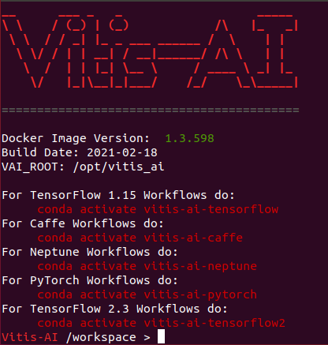

### 5.1 Demo
See this **[guide](DOC/Demo.md "Documentation")**.
```
source ./run_demo.sh
```
We used these model and dataset to quickly test our application code before deploying our own model.

### 5.2 Application
Run the following script to execute the whole process.
```
 source ./run_all.sh
```
This project is based on the workflow from Vitis AI tutorials using the [Anaconda](https://www.anaconda.com/ "Anaconda") environment for [TensorFlow](https://www.tensorflow.org/?hl=en "TensorFlow").

For more details, please consult this **[guide](DOC/Documentation.md "Documentation")**.

---
<div id='results'/>

## 6) Results
Here are some results after running the model on the FPGA :

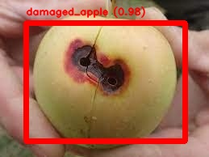 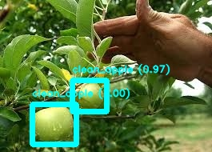 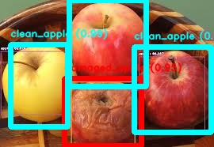 

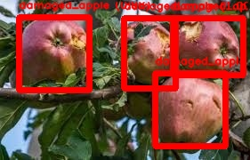  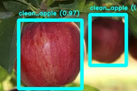 

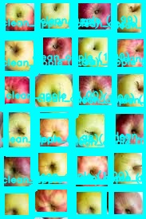 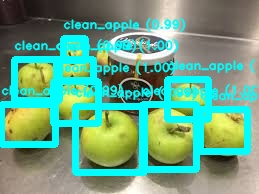

Let's evaluate the [_mAP_ score](https://www.kdnuggets.com/2020/08/metrics-evaluate-deep-learning-object-detectors.html "Metrics to Use to Evaluate Deep Learning Object Detectors") of the model running on the accelerator card. We set the confidence trheshold to 0.6 and the IoU threshold to 0.5.

| Model              | Original   | Intermediate graph  | App (on Alveo U280)         | 
| :---:              |   :---:    |  :---:              |  :---:                      | 
| mAP @ IOU50 score  |    75.0 %  |  x                  |  91.0 % on the training set |
| FPS                |    x       |  x                  |  12                         |

---
<div id='improvement'/>

## 7) Axes of improvement
- Find a way to be able to set the input shape with a variable when [compiling the model](workflow/10_compile_model.sh "Compile model");
- Create and annotate a new test set;
- Increase the [FPS](https://www.xilinx.com/html_docs/vitis_ai/1_3/him1591152509554.html "U280 Performance");
- Modify the [AlexeyAB application](https://github.com/AlexeyAB/darknet "AlexeyAB Darknet") that runs the Darknet model on the host machine to measure the execution time of the inference;
- Modify the [AlexeyAB application](https://github.com/AlexeyAB/darknet "AlexeyAB Darknet") to process the whole test set at once;
- Evaluate the [mAP score](https://towardsdatascience.com/map-mean-average-precision-might-confuse-you-5956f1bfa9e2 "mAP (mean Average Precision) might confuse you!") for the [AlexeyAB application](https://github.com/AlexeyAB/darknet "AlexeyAB Darknet") after changing the [output data](https://github.com/AlexeyAB/darknet#how-to-train-to-detect-your-custom-objects "AlexeyAB output") to fit the [annotations](https://github.com/developer0hye/Yolo_Label "Yolo_Label");
- [Modify the code to run the freeze/quantized TensorFlow graph](src/eval/run_graph.py "Run graph") to normalize the data to be able to evaluate its score;
- [Modify the code to run the freeze/quantized TensorFlow graph](src/eval/run_graph.py "Run graph") to draw boxes when running the graph;
- Improve the labels display in the [application code](src/app/yolov3.cpp "App");
- Run the [Vitis AI Profiler](profile.sh "Profile")

In order to deploy on the accelerator card your own YOLOv4 or YOLOv3 model, replace the '*.cfg*' and '*.weights*' files in [this folder](model/darknet "Darknet model"). Then, change the environment variables that determine the model specifications defined in the script ["1_set_env.sh"](workflow/1_set_env.sh "Set environment variables"). Set the input shape in the [script that compiles the model](workflow/10_compile_model.sh "Compile model"). Don't forget to update the name of the input and output tensors, and the shape of the input tensor. Finally, replace the current dataset by your own in [this folder](data "Dataset").

---
<div id='references'/>

## 8) References
The mentionned projects below were used for this project as tools or source of inspiration :
- [YOLO: Real-Time Object Detection by pjreddie](https://pjreddie.com/darknet/yolo/ "YOLO: Real-Time Object Detection")
- [YOLO Darknet by AlexeyAB](https://github.com/AlexeyAB/darknet "Darknet")
- [TF Keras YOLOv4/v3/v2 Modelset by David8862](https://github.com/david8862/keras-YOLOv3-model-set "david8862/keras-YOLOv3-model-set")
- [Xilinx - Vitis AI Tutorials](https://github.com/Xilinx/Vitis-Tutorials/tree/master/Machine_Learning "Vitis AI tutorials")
